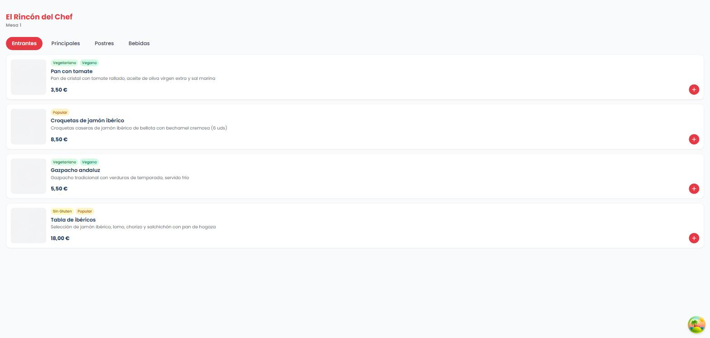
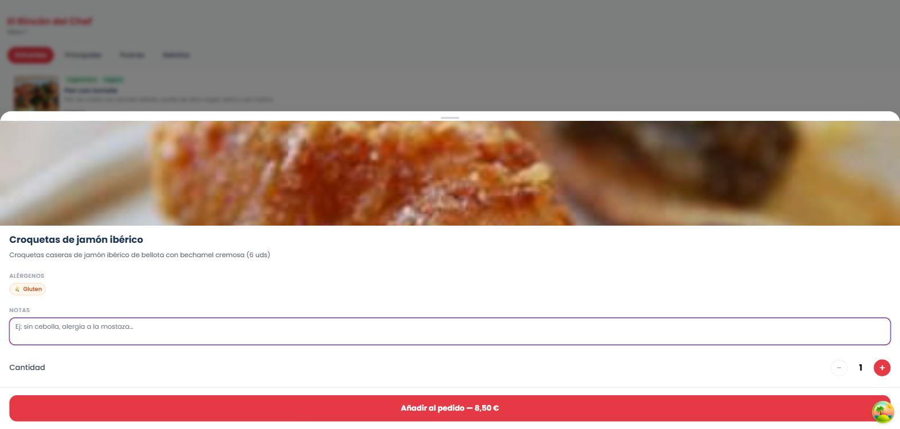
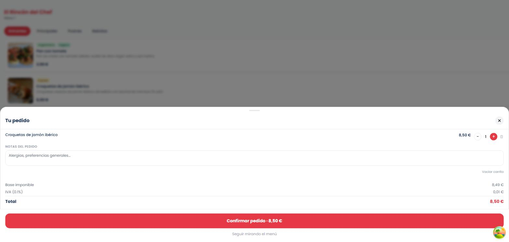
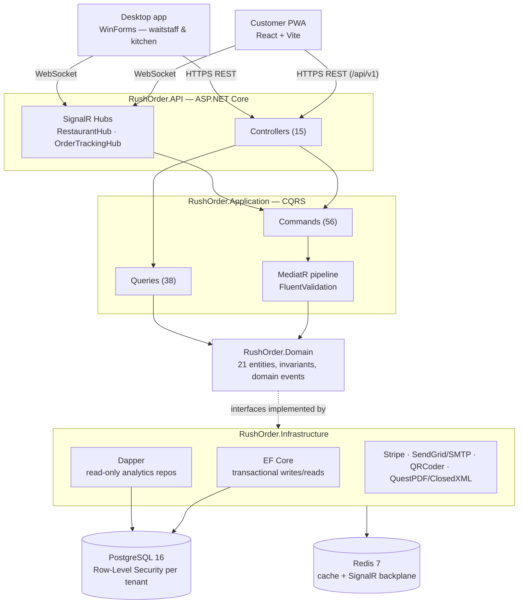

# Rush Order

> A multi-tenant SaaS platform for restaurants that runs the full order lifecycle — from a customer scanning a table's QR code to the kitchen marking a dish ready — across three coordinated clients kept in sync in real time.

[](https://github.com/nleceguic/rush-order/actions/workflows/ci.yml)


Rush Order targets independent restaurants that need one system covering three audiences at once: the **diner** ordering from their table via a PWA, **waitstaff and kitchen** running the floor from a Windows desktop app, and the **owner/manager** who needs occupancy, demand and revenue visibility without a separate BI tool. The backend is a Clean Architecture + CQRS system (.NET 8, MediatR, EF Core + Dapper) with tenant isolation enforced at the PostgreSQL row level — not only in application code — because it's built to host more than one restaurant.

## Screenshots

Captured from a local run of the seeded demo tenant ("El Rincón del Chef").

| Menu (per-table QR) | Product detail | Cart |
|---|---|---|
|  |  |  |

> The WinForms desktop app (Dashboard, Orders Kanban, Kitchen Display, Floor Plan) isn't captured here — it's a native Windows app outside the tooling available for this pass. Worth adding next: **Dashboard**, **Orders Kanban**, **Kitchen Display (KDS)**, **Floor Plan**, **Login**.

## Features

### Customer PWA (React)
- QR-scoped public menu with categories, allergen tags, and popularity/dietary badges
- Multi-step cart with per-item and per-order notes
- Product recommendations ("You might also like") from manually-configured pairing rules resolved via SQL co-occurrence — not ML yet (see [Roadmap](#roadmap))
- A/B-gated cart nudge and pre-checkout upsell banners
- Checkout via Stripe or cash-on-delivery
- Live order tracking screen over SignalR
- Post-order rating prompt
- Authenticated profile, order history, and a loyalty dashboard with points redemption
- Installable PWA: Workbox runtime caching (menu API, product images, fonts), custom install-prompt banner
- i18n-ready (i18next)

### Desktop app — waitstaff & kitchen (WinForms, Windows only)
- Dashboard with KPI widgets and a live alerts feed
- Interactive floor plan (zoom/pan/drag tables)
- Orders Kanban with real-time SignalR updates and a payment dialog
- Kitchen Display System (KDS) as a dedicated secondary-screen view
- Menu/product management
- Demand forecasting and an "AI panel" (today's forecast, suggestion of the day, average kitchen ETA)
- Offline mode: local SQLite queue with a dedicated conflict-resolution dialog on reconnect
- Excel/PDF export, printer configuration

### Platform / backend
- Real multi-tenancy: tenant resolved from the JWT, enforced twice — EF Core global query filters *and* PostgreSQL Row-Level Security as a second, database-level layer
- JWT auth (RSA-signed access + refresh tokens), BCrypt password hashing, TOTP-based MFA
- Stripe-backed subscription plans with plan-limit enforcement middleware, plus a self-serve tenant onboarding flow
- Platform admin panel for managing tenants and subscriptions
- Weekly insights email job (SendGrid) and transactional email via SMTP (MailHog in dev)
- Demand forecasting engine using order history plus a public holiday calendar, feeding both the desktop "AI panel" and the forecasting API

## Architecture

### Repository layout

```
rush-order/
├── backend/
│   ├── src/
│   │   ├── RushOrder.Domain/          # Entities, value objects, domain events — no external deps
│   │   ├── RushOrder.Application/     # CQRS: Commands/Queries/DTOs per feature module (MediatR)
│   │   ├── RushOrder.Infrastructure/  # EF Core, Dapper, JWT/TOTP, SignalR hubs, external services
│   │   └── RushOrder.API/             # ASP.NET Core Controllers, middleware, Swagger
│   └── tests/                         # Domain.Tests, Application.Tests, API.IntegrationTests
├── desktop/
│   └── src/RushOrder.Desktop(.Core)/  # WinForms app + shared SignalR client
├── pwa/                                # Vite + React 18 + TypeScript
├── infrastructure/
│   ├── docker/                        # Local dev docker-compose (Postgres, Redis, pgAdmin, MailHog)
│   └── terraform/                     # Azure IaC — dev/staging/prod
└── .github/workflows/                 # CI + CD pipelines
```

### Request flow



### Why it's built this way

**Clean Architecture.** `Domain` has no external dependencies; `Application` depends only on `Domain` and defines the interfaces (repositories, `IEmailService`, `IPaymentGateway`, …) that `Infrastructure` implements; `API` wires everything together at the edge. In practice this meant the switch from a single ORM to a mixed EF Core/Dapper persistence strategy, and the addition of Stripe/SendGrid, never touched `Domain` or the shape of a single `Command`/`Query` — only `Infrastructure` and its DI registration changed.

**CQRS with MediatR.** 56 commands and 38 queries are organized into 18 vertical feature modules (`Orders`, `Menu`, `Forecasting`, `Subscriptions`, …) instead of by technical layer. Commands go through EF Core so aggregate invariants and change-tracking apply; read-heavy, non-transactional queries — demand forecasting, recommendations, weekly insights, A/B experiment stats — bypass EF Core's tracking overhead and query PostgreSQL directly through Dapper. This is a deliberate split by access pattern, not an accident of two ORMs coexisting.

**Domain.** Entities own their own state transitions (e.g. what order-status transitions are legal) instead of leaving that logic to be re-implemented in a controller or a service. `RushOrder.Domain` compiles against nothing but MediatR's `INotification` marker for domain events.

**Infrastructure.** All persistence and every external integration (Stripe, SendGrid/MailKit, QRCoder, ClosedXML, QuestPDF) sit behind interfaces owned by `Application`. Multi-tenancy is the clearest example of this layering: `CurrentTenantService` resolves the tenant from a JWT claim, EF Core applies a global query filter by `TenantId` across persistence classes, and a dedicated migration turns on PostgreSQL Row-Level Security as a second enforcement layer below the application code.

## Tech Stack

| Layer | Technology |
|---|---|
| Backend runtime | .NET 8 (SDK pinned to `8.0.100` via `global.json`) |
| API | ASP.NET Core, Controllers (not Minimal APIs) |
| Architecture | Clean Architecture — Domain / Application / Infrastructure / API |
| CQRS / Mediator | MediatR 12.5 |
| Validation | FluentValidation |
| Mapping | Mapster |
| ORM — transactional | EF Core 9.0.18 + Npgsql provider (12 migrations) |
| ORM — analytics reads | Dapper (forecasting, recommendations, experiments) |
| Database | PostgreSQL 16 (Row-Level Security) |
| Cache / real-time backplane | Redis 7 |
| Real-time | SignalR (`RestaurantHub`, `OrderTrackingHub`) |
| Auth | JWT (RSA-signed) + refresh tokens + BCrypt + TOTP MFA (`Otp.NET`) |
| Payments | Stripe.net (checkout, webhooks, subscriptions) |
| Email | SendGrid + MailKit/SMTP |
| Export | ClosedXML (Excel), QuestPDF (PDF) |
| Observability | OpenTelemetry + Azure Monitor, Serilog, correlation IDs, `/health`, `/health/ready`, `/health/detailed` |
| Backend testing | xUnit, Moq, FluentAssertions, Bogus, Testcontainers (Postgres/Redis), Respawn |
| Frontend | React 18 + Vite 5 + TypeScript (strict) |
| Data fetching | TanStack Query 5 |
| Client state | Zustand 4 |
| HTTP client | Axios (JWT injection, single-flight refresh, retry with backoff) |
| Styling | Tailwind CSS 3, custom brand tokens |
| PWA | vite-plugin-pwa / Workbox |
| i18n | i18next |
| Frontend testing | Vitest (configured, no unit specs yet) + Playwright (E2E) |
| Desktop | WinForms, .NET 8 (`net8.0-windows`) |
| Desktop charts/export | LiveCharts2, ClosedXML, QuestPDF |
| Desktop offline storage | SQLite (`Microsoft.Data.Sqlite`) |
| Containers | Docker, Docker Compose (dev + prod) |
| IaC | Terraform — Azure (App Service, PostgreSQL, Redis, Key Vault, Service Bus, Static Web Apps, Storage, Monitor) |
| CI/CD | GitHub Actions (build/test/coverage gate, lint/typecheck, Lighthouse CI, Trivy image scan, OWASP ZAP DAST) |

## Getting Started

### Prerequisites

| Tool | Version | Needed for |
|---|---|---|
| .NET SDK | 8.0 (pinned in `global.json`) | backend, desktop, tests |
| Node.js | 20 LTS | PWA |
| Docker + Docker Compose | 24+ / 2.x | PostgreSQL, Redis |
| Windows | — | desktop app only |

```bash
git clone https://github.com/nleceguic/rush-order.git
cd rush-order
```

### 1. Infrastructure

```bash
cp .env.example .env
bash infrastructure/docker/start-dev.sh
```

Starts PostgreSQL 16, Redis 7, pgAdmin and MailHog.

### 2. Backend API

```bash
cd backend/src/RushOrder.API
ASPNETCORE_ENVIRONMENT=Development dotnet run
```

On first run, a hosted `DatabaseInitializer` applies every pending EF Core migration and seeds a full demo tenant automatically — no manual `dotnet ef database update` needed.

```bash
curl http://localhost:5000/health
```

Swagger UI: http://localhost:5000/swagger

Seeded demo accounts (tenant "El Rincón del Chef"):

| Role | Email | Password |
|---|---|---|
| Owner | `owner@demo.com` | `Demo1234!` |
| Manager | `manager@demo.com` | `Demo1234!` |
| Waiter | `waiter@demo.com` | `Demo1234!` |
| Kitchen | `kitchen@demo.com` | `Demo1234!` |
| Platform admin | `admin@rushorder.app` | `Admin1234!` |

### 3. Customer PWA

```bash
cd pwa
cp .env.example .env   # already points at the seed's fixed demo table QR code
npm install
npm run dev
```

Open http://localhost:5173 to see the demo restaurant's public menu.

### 4. Desktop app (Windows only)

```bash
cd desktop/src/RushOrder.Desktop
dotnet run
```

The backend base URL (`http://localhost:5000`) is hardcoded — there's no config file. Log in with any seeded account above.

> Steps 1–3 above were run against this exact repository to produce this README — the health check, Swagger UI, and the screenshots in this document all come from that run.

## Configuration

No secrets are committed. Two example files define the required variables:

- **`.env.example`** — local dev, used by `infrastructure/docker/docker-compose.yml` and the backend.
- **`.env.production.example`** — production, used with `docker-compose.prod.yml`.

```bash
# .env.example (dev)
POSTGRES_DB= POSTGRES_USER= POSTGRES_PASSWORD= POSTGRES_PORT=
REDIS_PORT=
PGADMIN_EMAIL= PGADMIN_PASSWORD= PGADMIN_PORT=
MAILHOG_SMTP_PORT= MAILHOG_UI_PORT=
ASPNETCORE_ENVIRONMENT= API_PORT=
JWT_KEY= JWT_ISSUER= JWT_AUDIENCE= JWT_EXPIRY_MINUTES=
```

```bash
# .env.production.example (prod — copied to .env.production)
POSTGRES_DB= POSTGRES_USER= POSTGRES_PASSWORD=
API_PORT= JWT_ISSUER= JWT_AUDIENCE=
PWA_PORT= PWA_ORIGIN= VITE_API_URL= VITE_RESTAURANT_ID= VITE_VAPID_PUBLIC_KEY=
STRIPE_SECRET_KEY= STRIPE_PUBLISHABLE_KEY= STRIPE_WEBHOOK_SECRET=   # required — see note below
SMTP_HOST= SMTP_PORT= SMTP_FROM_NAME= SMTP_FROM_ADDRESS= SMTP_USE_SSL= SMTP_ADMIN_EMAIL=  # optional
APPINSIGHTS_CONNECTION_STRING=   # optional
```

The three Stripe variables are enforced by startup validation — the API refuses to start in a non-Development environment without them (confirmed while writing this README: running the backend with `ASPNETCORE_ENVIRONMENT` unset threw an `OptionsValidationException` for the missing connection string and Stripe key on boot). SMTP and Application Insights degrade gracefully — if unset, the relevant service logs a warning and no-ops instead of failing startup.

## Running the tests

```bash
# Backend — Domain + Application (no Docker required)
dotnet test rush-order.sln -c Release --filter "FullyQualifiedName!~IntegrationTests"

# Backend — full suite including API integration tests (Testcontainers spins up
# ephemeral Postgres/Redis containers — requires a running Docker daemon)
dotnet test rush-order.sln -c Release
```

Verified locally while writing this README: `Domain.Tests` 47/47 and `Application.Tests` 47/47 passing (xUnit, FluentAssertions, Bogus fakers). `RushOrder.Desktop.Tests` also passes, 5/5.

```bash
# PWA — unit test runner (Vitest is wired up; no unit specs exist yet, CI passes with 0)
cd pwa && npm run test:ci

# PWA — end-to-end (Playwright), 5 real specs: accessibility, api-health,
# customer-journey, payment-flow, pwa-installable
npx playwright test tests/e2e
```

CI (`.github/workflows/ci.yml`) enforces a hard **≥70% line-coverage** gate on `Domain` + `Application` only (`coverlet.runsettings` + ReportGenerator), on every push and PR to `main`/`develop`. No external coverage service (Codecov/Coveralls) is connected, so no coverage badge or number is claimed here beyond that gate.

## Deployment

Two deployment paths exist in the repo; neither is currently live.

**Self-hosted (single VM).** `docker-compose.prod.yml` (root) builds and runs PostgreSQL, Redis, the API, and an nginx-served PWA build as four containers on one Docker host:

```bash
cp .env.production.example .env.production   # fill in real values
docker compose -f docker-compose.prod.yml --env-file .env.production up -d --build
```

**Cloud (Azure, via IaC + CI/CD).** `infrastructure/terraform/` provisions Azure App Service, managed PostgreSQL, Redis, Key Vault, Service Bus, Static Web Apps, Storage and Monitor across `dev`/`staging`/`prod` environments. Two GitHub Actions workflows drive deploys on top of that: `cd-staging.yml` deploys automatically on every push to `develop` (build → push image → deploy API + PWA → run migrations → Playwright smoke tests → k6 load test → auto-rollback on failure), and `cd-production.yml` is a manually-triggered, tag-gated blue/green App Service slot swap with the same rollback safety net. Neither workflow has a live target URL committed to the repo — staging/production endpoints are injected at deploy time via GitHub Actions `vars`/`secrets`, configured outside of source control.

## Demo

No public demo is currently deployed. Given the pipelines above already exist, the lowest-effort path to one would be provisioning an Azure subscription, configuring `cd-staging.yml`'s required secrets/vars (App Service name, PostgreSQL/Redis connection info, Stripe test keys), and letting a push to `develop` run the existing staging pipeline — no architectural change needed, just infrastructure to point it at.

## Roadmap

Two concrete next steps are already designed in `docs/product/` (not yet built):

- **Signed QR session tokens** ([`docs/product/qr-session-design.md`](docs/product/qr-session-design.md)) — replaces today's direct QR→table resolution with a signed session token, so anonymous customer ordering (currently blocked by a tenant-context check on order creation) works end-to-end for a real walk-in customer, not just authenticated staff.
- **ML-based recommendations** ([`docs/product/recommendations-ml-plan.md`](docs/product/recommendations-ml-plan.md)) — replaces today's manually-configured SQL co-occurrence pairing rules with a trained model.

## Contributing

This is a solo-maintained project (single `CODEOWNERS` entry) built as a portfolio piece, with per-module review rules and a PR template already in place. Every PR runs through the full CI gate — build, tests with the coverage threshold, lint/type-check, Lighthouse, and a container security scan — before it can merge.

## License

No `LICENSE` file is currently included in this repository — all rights reserved by default until one is added.
